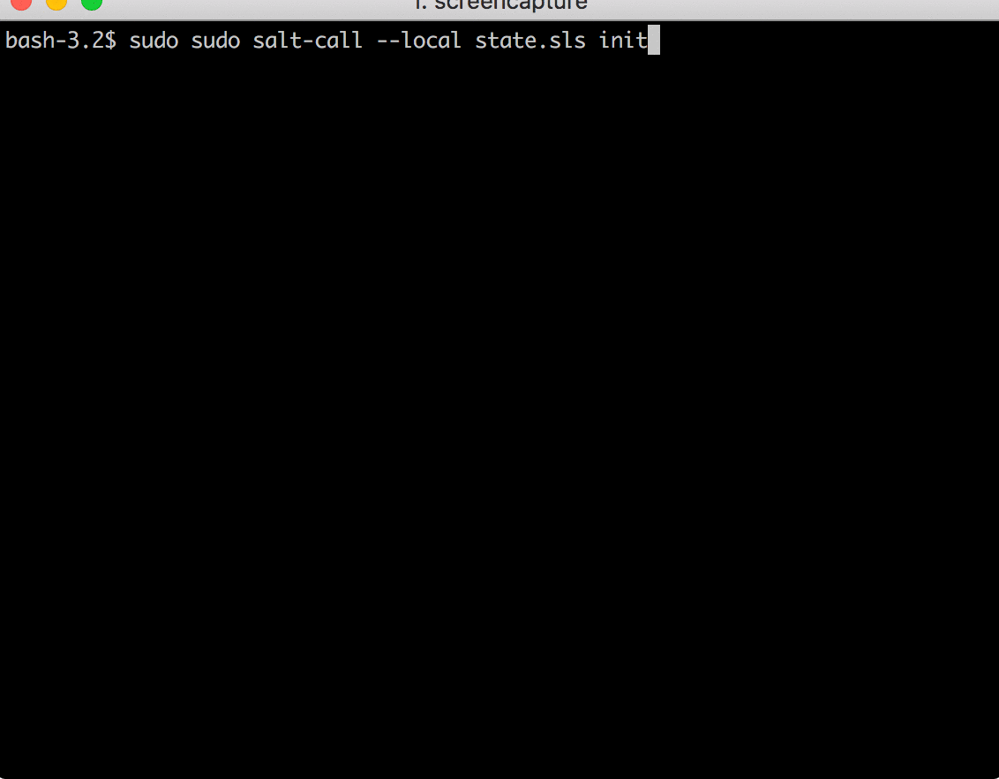
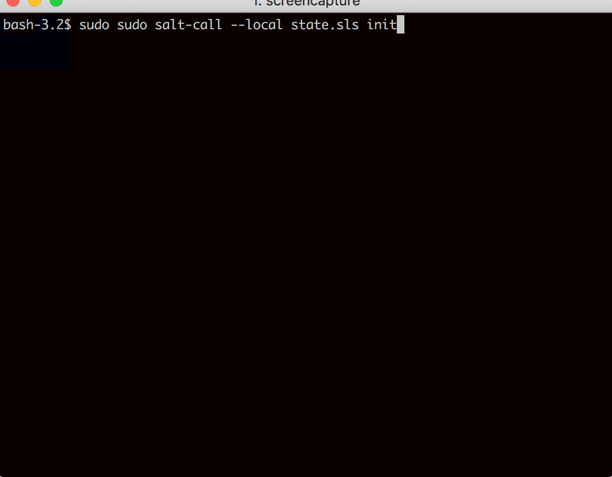

## Custom States

Inspired by
https://github.com/facebook/IT-CPE/tree/master/chef/cookbooks/.

### bk_hosts.py

Manages entire hosts file idempotently. Respects system entries and user's additions.

To add extra entries, simply append to `pillar['bk_hosts']['extra_entries']`, like so:

```YAML
bk_hosts:
  extra_entries:
    192.168.1.87:
      - blargety
      - lol
    192.168.1.89:
      - margety
      - foo
```



To remove extra entries, simply remove data from `pillar['bk_hosts']['extra_entries]`:

```YAML
bk_hosts:
  extra_entries:
    # 192.168.1.87:
    #   - blargety
    #   - lol
    192.168.1.89:
      - margety
      - foo
```


